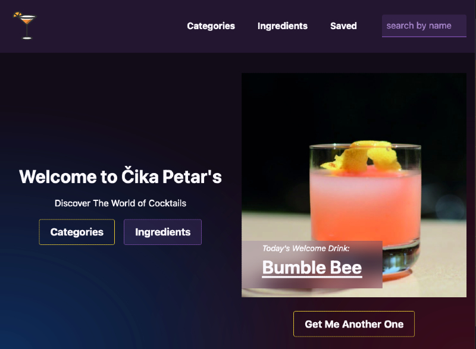

# Čika Petar's

Welcome to Čika Petar's cocktail bar.
[Demo Site](https://bar.megumi.no/)


## Description

Čika Petar's cocktail bar is a frontend project of Cocktail database where user can lookup cocktail recipes by name or ingredient or get inspirations.

## Stack

- Sveltekit
- TypeScript
- Tailwind
- Skeleton UI
- Vite
- [TheCocktailDB](https://www.thecocktaildb.com/api.php)

## Getting Started

### Installing

1. Clone the repo:

```bash
git clone https://github.com/MegumiKim/barapp.git
```

2. Install the dependencies:

```bash
npm install
```

## Developing

Once you've created a project and installed dependencies with `npm install` (or `pnpm install` or `yarn`), start a development server:

```bash
npm run dev

# or start the server and open the app in a new browser tab
npm run dev -- --open
```

You can preview the production build with `npm run preview`.

## Contact

Contact me on [github](https://github.com/MegumiKim)

## License

Copy Right 2023 Megumi Kimura
